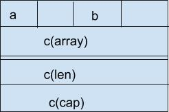

# unsafe

虽然我们程序中引入 unsafe `import "unsafe"` 像是引入其他使用 go 实现的包一样，unsafe 包下的功能是不是通过 go 代码实现的，而是通过**编译器**实现的。

unsafe 中的功能暴露了 Go 底层的实现细节，虽然 Go 是跨平台的，但是每个平台上 Go 底层实现都不一样，这样就造成在不同平台上 unsafe 的表现可能有所不同，而且 unsafe 不保证向后兼容。unsafe 包广泛被和操作系统交互的低级包中，如 runtime、os、syscall 和 net。

> 普通程序不需要使用 unsafe

举一个例子体现 unsafe 的奇怪：

```go
type ArbitraryType int

func Sizeof(x ArbitraryType) uintptr
```

如果站在 Go 语法上说，unsafe.Sizeof() 不可能接收任意类型的参数，但是事实上 unsafe.Sizeof() 可以接收任何类型的参数，所以说这个非常奇怪。**编译器做了手脚**

slice 中结构中不是真的存储了一个数组的指针，而是一个 unsafe.Pointer：

```go
type slice struct {
    array unsafe.Pointer
    len   int
    cap   int
}
```

## 字

int 类型的长度都是跟当前操作系统的位数相关的，比如在 32 位系统上为 32 位，在 64 系统上为 64 位。

操作处理数据最小的单位不是 bit，也不是 byte 而是一个字（不是字节）。那么一个字的长度是多少呢？32 位操作系统为 32 位 4 字节，64 位操作系统为 64 位 8 字节。

我电脑为 64 位操作系统：

```go
fmt.Println(unsafe.Sizeof(int(0)))  // 8
```

## 结构体中变量编排

如果结构体成员的类型是不同的，那么**将相同类型的成员定义在一起可以节省内存空间**。以下三个结构体拥有相同的成员，但是第一个定义比其他两个定义要多占内存。

```go
fmt.Println(unsafe.Sizeof(struct {
        bool; float64; int16
    }{}))       // 24
    fmt.Println(unsafe.Sizeof(struct {
        float64; int16; bool
    }{}))       // 16
    fmt.Println(unsafe.Sizeof(struct {
        bool; int16; float64
    }{}))       // 16
```

```go
var x struct {
    a bool
    b int16
    c []int
}
```

其内存布局如下：



```go
Sizeof(x) = 32      Alignof(x) = 8
Sizeof(x.a) = 1     Alignof(x.a) = 1    Offsetof(x.a) = 0
Sizeof(x.b) = 2     Alignof(x.b) = 2    Offsetof(x.b) = 2
Sizeof(x.c) = 24    Alignof(x.c) = 8    Offsetof(x.c) = 8
```

Alignof 查看的对齐方式。x.a 是一个字节一个字节地对齐，x.b 是两个字节两个字节地对齐，x.c 是八个字节八个字节对齐。

Offsetof 查看变量在从结构体开头的偏移量。

Sizeof、Alignof、Offsetof 三个方法是安全的，我们可以通过他们来查看某个结构体中变量的大小、对齐和排列等信息。

## unsafe.Pointer

unsafe.Pointer 是一个特殊的指针，能够指向任何类型的变量地址。但是无法直接使用 unsafe.Pointer 指针对变量进行操作或访问，因为还不知道指向地址的具体类型，因为只有知道了具体类型后才知道如何解析里面的数据。如，`1101000` 一个字节可以解析为 'h' 或者是 104。

我们也可以将指针的内容强制解析为某些类型，或者直接对其数据进行更改（这是不安全的）。下面例子中，我们将浮点数的内容当做 int64 来解析，然后又将整形数目写入到本来是浮点数的内存中，最后当做浮点数来解析：

```go
f := 1.0
pf := &f
pi := (*int64)(unsafe.Pointer(pf))
fmt.Printf("%d\n", *pi)     // 4607182418800017408
*pi = 0
fmt.Printf("%g\n", f)       // 0
```

**这样的代码可读性必然差。**

还可以访问任意本程序中的任意内存地址？

是的，uintptr 和 unsafe.pointer 之间进行转换，而 unsafe.Pointer 可以转化为任意类型的指针。但是 uintptr 传递的不都是合法的内存地址，这样做会破坏类型系统。但是还是来个 demo 看看：

```go
var x struct {
    a bool
    b int16
    c []int
    }
pb := (*int16)(unsafe.Pointer(uintptr(unsafe.Pointer(&x)) + unsafe.Offsetof(x.b)))
fmt.Printf("%v %v\n", pb, &x.b)   // 0xc42000a062 0xc42000a062
*pb = 1
fmt.Println(x.b)    // 1
```

上面我们中规中矩采用的是 x 的地址再加偏移量得到的 b 的地址，要是我们随便读取一个地址呢？

```go
ptr := (*int16)(unsafe.Pointer(uintptr(0xc42000a0)))
fmt.Printf("%v %b\n", ptr, *ptr)
```

输出：

```
unexpected fault address 0xc42000a0
fatal error: fault
[signal SIGSEGV: segmentation violation code=0x1 addr=0xc42000a0 pc=0x48988b]
```

Ooops，说了不是所有地址都是合法的内存地址。

还有一种很隐晦的错误：

```go
tmp := uintptr(unsafe.Pointer(&x)) + unsafe.Offsetof(x.b)
pb := (*int16)(unsafe.Pointer(tmp))
*pb = 1
```

如果进行 GC 后，变量的位置可能已经发生了移动，这时候地址可能已经不是之前那个地址了。当进行垃圾回收时变量移动，指针（unsafe.Pointer、*T）的值也跟随这变量的地址改变而改变，但是上面例子 tmp 是一个 uintptr 类型变量，GC 不会进行指针同步，缓存失效。goroutine 的连续栈增长时也会导致类似错误。

类似的错误：

```go
ptr := uintptr(unsafe.Pointer(new(T)))
```

变量 new(T) 可能在创建后马上被 GC 回收，因为 GC 检测不到有任何指针指向该内存。**uintptr 不是指针**

两个地址相同的变量一定相等吗？

如果你还记得上面那个图片，那么你就知道不是的。不信的话运行下面的程序：

```go
var x struct {
    a bool
    b int16
    c []int
}
fmt.Printf("%p %p\n", &x, &x.a)
```

