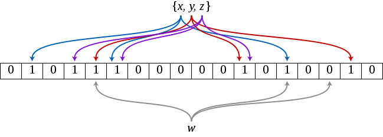

# In short

以下是我在字节跳动面试中遇到的一道算法题：

> 有 50GB 的 URL 文件，从中寻找出现次数前 10 的 URL，其中 URL 长度最大为 1024B，需要在一台内存为 2GB 的机器中完成。

PS: 面试官后面允许统计中可有一定的误差。

*面试过程中回答的并不好。*

# Main

## 方案一 排序

解决思路：通过外部排序将 50GB 的 URL 进行一次排序，排序后相同的 URL 会相邻，然后扫描 50GB 的文件，统计每一个 URL 出现的次数，使用小根堆维护 Top 10 的 URL。

面试官显然不满意这个答案，问以上解决方案的空间复杂度和时间复杂度。

时间复杂度和空间复杂度的瓶颈都在外部排序上，假设使用归并排序实现外部排序，那么时间复杂度为 `O(1024nlogn)`，空间复杂度为 `O(n)`，也就是需要额外的 50GB 的磁盘空间。`O(50GBlog(50GB)）≈ 1913614957980.12`，即使 CPU 一秒能够执行 10亿 条指令，完成整个过程也至少需要 2000秒，如果加上磁盘频繁的读写，整个程序肯定会运行得很慢，这显然不是一个理想的解决方案。

如果有多台 2GB 内存的机器，可以借助 MapReduce 并行计算的威力。

## 方案二 哈希计数

如果 URL 大部分是重复的，那么 50GB 放入 2GB 内存中统计也是一个可以解决的方案，但是如果重复可能性不大，那么该方案也就无法在 2GB 内存中完成。

解决思路：每次从文件中读取一个 URL，对 URL 进行哈希，然后自增对应的哈希值，扫描一遍文件后，得出出现次数 Top 10 的哈希值，然后再对 50GB 文件做一次扫描，找出哈希值与 Top 10 哈希值一致的 URL，并对这些 URL 进行统计计数，由于哈希可能存在冲突，所以最后取出的 URL 不只有 10 个，再从这些 URL 中筛选出现次数 Top 10 的 URL。

假设每个 URL 都不同，且每个 URL 长度为 1024B，那么 50GB 里大概有 52428800 个 URL，大概需要 26 字节才能够标识每一个 URL（`2^25 < 52428800 < 2^26`），`(2^30 * 8) - 52428800 * 26 = 7226785792`，`7226785792 / 8 / 52428800 ≈ 17`，平均一个 URL 有 17字节做计数统计，足以做统计计数了。

哈希函数选择 MD5 足矣，MD5 有 128位，能够标识 340282366920938463463374607431768211456 个 URL，远超当前场景需求。

这个方案会在一个问题，可能不准确。

## 方案三 哈希切割文件

> 这是虎牙面试官给的思路，没错虎牙面试问了同一个问题。

如果能够将所有 URL 放进内存统计计数，那么这个这个问题也就迎刃而解。

内存不够一般做法：

1. 使用位图等数据结构尽可能压缩数据
2. 借助外存（磁盘）
3. 牺牲准确性，使用基于统计概率的算法

这个方案主要是借助磁盘空间，需要 O(n) 的磁盘空间，在这一题中是 50GB，将 50GB 的大文件，切分为每一个大小大约为 1GB 的小文件，足以放进内存进行统计计数。

步骤：

1. 顺序读入 50GB URL，将每一个 URL 进行以下操作
2. 计算 URL 的 MD5 值，将该 URL 写入文件名为 `Hash % 50` 文件中。得到名为 0 ~ 49 大小约为 1GB 的文件
3. 分别计算每个文件 URL 出现次数 Top10 的 URL
4. 利用步骤 3 的结果，求出 50GB URL 中出现次数 Top10

解释：

1. 哈希是为了将 URL 数值化，把 URL 归类
2. `m = Hash(x)`，如果 x 一样，那么产生的 m 一定一样，也就是想同的 URL 一定被写入到同一个文件，方便统计计数

缺点：如果 50GB 文件中 URL 比较凌乱，随机写 50GB 数据到磁盘性能是很差的。

优化：扫描 50GB URL 50次，每次写入 `Hash(URL) % 50 == time` 的文件，批量读写，每次读写的大小近可能以磁盘页为单位进行，将磁盘的随机读写转化顺序读写。

## 方案四 Trie

[Trie](https://en.wikipedia.org/wiki/Trie) 前缀树，树中的每一个节点都存储键的一部分信息，因为一个节点存储的信息可以被多个键复用，大大地降低了数据的冗余，提升存储效率。在判断英文单词前缀是否正确，匹配最长前缀等有应用。

面试时候想到这个方案，但是没有说出这种方案，因为假设 URL 平均长度为 20 个字符且仅包含 ASCII 编码的字符，那么 Trie 树的高度为 20，每一个节点有 255 个子节点，也就是 Trie 树子节点的数量大概为 `255^20 == 1351461283755592687189686338827705478668212890625`，不可能存储在 2GB 的内存中。

## 方案五 布隆过滤器

[布隆过滤器](https://en.wikipedia.org/wiki/Bloom_filter)的优点：不存储具体的键数据，借助多个稀疏哈希函数来对数据进行快速地检索，能够保证布隆过滤器判断键不存在的情况下，该键一定不存在；如果布隆过滤器判断键存在的情况下，该键以一个可以推算的概率判断它存在。

后面被问将 50GB 的数据映射到 2GB 内存中，布隆过滤器的错误率是多少。之前简单看过布隆过滤器的错误率计算公式，但是没理解清楚，没答上。知其然不知其所以然。我预估冲突概率的思路：

假设布隆过滤器占用内存为 1GB，有 10 个数组，每个数组长度约为 100MB 有 838860800位，能够标示 `2^838860800` 个元素，50GB URL 中大概有 52428800 个链接，每个 URL 通过稀疏哈希生成的 1 个数都 10 个，`52428800 * 10 / (2^838860800)` 错误率小到可以忽略。

解决思路：在内存中建立一个接近 2GB 大小的布隆过滤器，每取出一个 URL 都判断这个 URL 是否已经加入到布隆过滤器中，如果已经加入到就自增 URL 计数，否则将 URL 添加到布隆过滤器中。

上述方案最大的问题是如何以及在哪里进行统计计数。对于这个问题实在没有想到好的解决方案，能够想到的就是在磁盘上进行统计计数，说实话这个方案并不理想。

## 方案六 Count-Min Sketch

[Count-Min Sketch](https://en.wikipedia.org/wiki/Count%E2%80%93min_sketch) 是布隆过滤器的变种，除了能够判断一个键是否存在外，还能够记录该键出现的次数，与本题目的要求非常符合。

Count-Min Sketch 适用于 Top K 都是出现次数非常多的，也就是与其他相差悬殊，但是如果每个 URL 出现次数相差不大，那么使用 Count-Mean-Min Sketch 会更好。

如果对于数据准确性要求更高，可通过 Count-Min Sketch 统计计数，将出现次数大于某个阈值的 URL 加入到堆中进行排序。

## 方案七 Lossy Count

[Lossy Count](https://micvog.com/2015/07/18/frequency-counting-algorithms-over-data-streams/) 有损计数，有可能产生误报，但是可以将误报控制在一定的概率下，建议点开博客链接查看具体算法实现。

大概步骤：

1. 将元素集合平均分为若干个窗口
2. 合并相邻窗口，将相邻窗口相同的元素数量相加，并且每个元素数量减一
3. 一直进行步骤 2，直到所有窗口合并完成
4. 剩下的元素就是高频元素

核心思想：通过不断地筛选，最后剩下的都是高频元素。

如果应用在本例 URL TopK 的筛选，将 50GB 平均分为 100 个窗口处理，每个窗口大小约为 0.5GB，先加载第一个窗口进内存，并对 URL 进行统计计数，依次加载 2 ～ 100 号窗口进内存，统计计数，所有 URL 统计数量 -1，如果 -1 后变为 0 就舍弃该元素（该元素很有可能不是高频的元素），统计合并完所有窗口后，剩下的元素中，通过排序或堆得出 TopK URL。

## 方案八 HyperLogLog

Redis 有一个基于概率的统计计数解决方案 HyperLogLog，该算法能够控制在 10^9 个元素下，只消耗 1.5KB 内存，且将错误率控制在 2% 以下。

# End

上述很多方案都需要用到哈希运算，要注意的是不是所有哈希函数否符合条件的，对于布隆过滤器等应用应该选择 murmurhash 稀疏哈希（期待 0 远多于 1），而不是像 sha1、md5 这种每一位是 0 还是 1 的概率都是相等。

布隆过滤器、Count-Min Sketch以及 Lossy Count 都是基于概率的解决方案，能将保证误报率控制在某个阀值下，且相对其他绝对准确的解决方案，能够节省大量的内存以及处理时间。

Count-Min Sketch、Lossy Count 和 Redis HyperLogLog 在平常阅读博客中已经接触过，但是只是简单地知道它的存在，对两者没有很好的理解，关键时候没有联想到。还是书读的少，很多东西知其然不知其所以然（**You don't know what you can't build.**）。平时应该多关注其他公司比较先进的架构设计理念，成知识体系地看书。

在处理数据量大的情况下，应该借助位图、MapReduce和统计学方面的知识去解决问题。

对大数据下的统计计数感兴趣的可以参考：

- [https://highlyscalable.wordpress.com/2012/05/01/probabilistic-structures-web-analytics-data-mining/](https://highlyscalable.wordpress.com/2012/05/01/probabilistic-structures-web-analytics-data-mining/)
