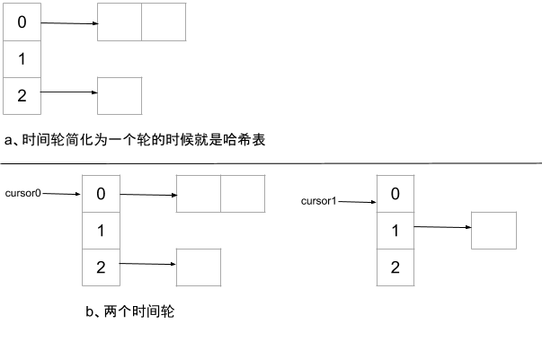

今天看公司定制RocketMQ可支持随意定DeferDelay feature，其采用时间轮方案实现，在网上搜索时间轮相关的文章没看懂，看原[论文](http://www.cs.columbia.edu/~nahum/w6998/papers/sosp87-timing-wheels.pdf)，现在弄清楚后写一篇文章概述。

## Why Time Wheel

> 一个思路被提出，必定是针对某个场景做了优化
> 
> Or it lies.

时间轮被RocketMQ、Kafka、Netty和Linux内核定时器等优秀项目采纳，必定是有它的优势所在。

## Easy Time Schedule Algorithm

定义：

1. n：当前需要调度的时间事件数量
2. Insert：插入一个事件调度事件
3. Tick：事件触发的最小粒度
4. event：时间事件
5. event.ExecTime：时间事件触发时间戳
6. current_timestamp：当前触发的时间戳

### 1. Straight-Forward break

最简单的思路是将所有时间调度事件都维护在一个无序链表中，每个Tick到来都遍历所有的event，将`event.ExecTime<=current_timestamp`的event从队列中移除，并调度该任务。

时间复杂度：

| Insert | Tick |
| --- | ---- |
| `O(1)` | `O(n)` |

## 2. Sorted Linked List

针对(1)方案因为无序导致每次都需要遍历所有的时间，(2)优化为将时间事件按照触发事件排序。

时间复杂度：

| Insert | Tick |
| --- | --- |
| `O(n)` | `O(1)` |

## 3. HashTable

假设触发时间单位为秒，分N个哈系桶，通过`which_bucket_for_event = event.ExecTime % N`决定当前event应该被放置到哪个桶中，然后将event添加到bucket中的链表。当Tick触发时，定位到桶`bucket_index = current_timestamp % N`，将该桶中的时间事件取出然后判断哪些事件可执行。

类似于(1)和(2)的思想，这里的bucket中的链表也可以选择排序好的。

(3)比没有比(1)和(2)思想高大上，它仅是通过桶来做sharding，降低基数。

每个bucket中的链表都排序的时间复杂度：

| Insert | Tick |
| ---- | ---- |
| `O(n/N)` | `O(1)` |

> 时间轮训调度是一个读多写少的场景，排序能够更好地优化读。

## 4. Min-Heap

小顶堆。go编程语言中的Timer就是采用了小顶堆的设计，在时间事件不多的时候，纯内存`O(log(n))`性能也是可以接受的。NSQ的deferSend也是小顶堆实现的。

小顶堆的时间复杂度：

| Insert | Tick |
| --- | --- |
| `O(log(n))` | `O(log(n))` |

## Time Wheel

时间轮的时间复杂度：

| Insert | Tick |
| ---- | ---- |
| `O(1)` | `O(1)` |

没错 Insert/Tick 均优于其他方案，时间轮是同时借鉴了(2)和(3)的思路，下面讲解时间轮的算法实现。

下图为简单的时间轮图描述。

**约束：使用时间轮其可以承载的时间是有范围限制的，比如上图中，采用两个轮，每个轮的长度为3，其组多能承受`3*3=9`的延时调度。**

假设1s触发Tick，时间轮可以有很多轮，但是为了简单期间，本文讲解两个轮。初始情况下，cursor0/cursor1均指向位置0。

当**Insert**一个新的时间事件时，假设其延时为3s，则将其插入到cursor0指向的位置为2的链表中；再次插入一个延时为5s的事件，则将其插入到cursor1指向位置为1的桶，并且记录其触发的时间还剩5秒。

**Tick** cursor0每隔1s移动一格（`cursor0=(cursor0+1)%3`），当cursor0循环一个轮回之后，`cursor1=(cursor1+1)%3`；当x秒过去后，`cursor0=x%3`，`cursor1=(x/3)%3`。每隔1s，将curosr1指向的时间事件如果剩余调度时间<3，则移除并重新插入到时间轮中；否则将cursor1指向的时间事件剩余时间`-=3`，触发cursor0指向的时间事件。

相当于全局有序链表在插入时候时间复杂度高，降低触发时间复杂度；时间轮是将时间复杂度分摊到每个Tick中，看起来更加实时。
