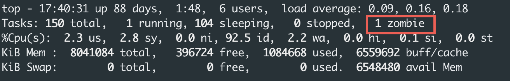

## 什么是僵尸进程

僵尸进程的概念我看了N次，但总记不住，所以通过本文来加强我的肌肉记忆。

Concept: *Zombie process is child process had beed dead, and its parent is still alive.*

## 僵尸进程有什么危害

僵尸进程其实是一个已经死了的进程，绝大部分资源已经被操作系统回收了，但是其还在占用pid和进程表。如果僵尸进程数量过多，导致操作系统无法创建新的进程（极限情况下pid被用光了，在64位操作系统下几乎不需要担心这个问题）。

## 如何查看僵尸进程

通过 top 命令查看：



## 为什么会存在僵尸进程

操作系统需要提供一个方法供父进程查看子进程的处理结果（典型的是exit_status），所以操作系统需要维护子进程的信息，即使其已经结束了。

下面我们来简单地创建一个会产生僵尸进程的代码：

```c
#include <stdio.h>
#include <string.h>
#include <sys/types.h>
#include <unistd.h>

#define MAX_COUNT 200
#define MAX_SIZE 100

int main(void)
{

    pid_t pid;
    pid_t child_pid;

    child_pid = fork();
    pid = getpid();
    printf("child_pid: %d pid: %d\n", child_pid, pid);
    if (child_pid > 0)
    {
        printf("parent sleep\n");
        usleep(100000000);
    }
}
```

僵尸进程的存在不一定是程序的bug，有可能子进程结束了，但是父进程还没调用wait，在某些逻辑下是一个正常的场景。即使父进程没有调用wait，在父进程退出时，操作系统也会回收其下的僵尸进程。

不会长时间存在僵尸进程的代码：

```c
#include <stdio.h>
#include <string.h>
#include <sys/types.h>
#include <unistd.h>
#include <sys/wait.h>

#define MAX_COUNT 200
#define MAX_SIZE 100

int main(void)
{

    pid_t pid;
    pid_t child_pid;

    child_pid = fork();
    pid = getpid();
    printf("child_pid: %d pid: %d\n", child_pid, pid);
    if (child_pid > 0)
    {
        waitpid(child_pid, 0, 0);
        printf("parent sleep\n");
        usleep(10000000);
    }
}
```
